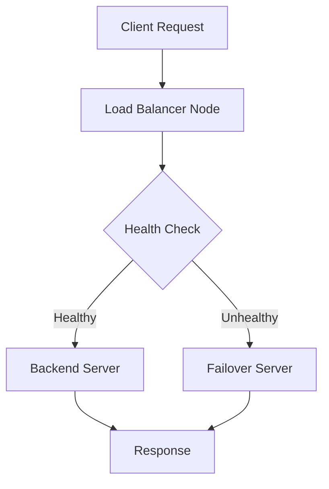

# Architecture Overview

## System Design

The Distributed Load Balancer is built with a primary-secondary architecture, featuring:

### Core Components

1. **Cluster Manager**

   - Manages node coordination
   - Handles health checking between nodes
   - Maintains cluster state

2. **Load Balancer Core**

   - Implements weighted round-robin algorithm
   - Manages backend server pool
   - Handles request distribution

3. **Health Checker**

   - Monitors backend server health
   - Updates server status
   - Manages failover

4. **Rate Limiter**
   - Implements sliding window algorithm
   - Prevents server overload
   - Configurable limits

### Distributed Features

- Primary-Secondary Architecture
- Health Monitoring
- Automatic Failover
- State Synchronization

## Data Flow

